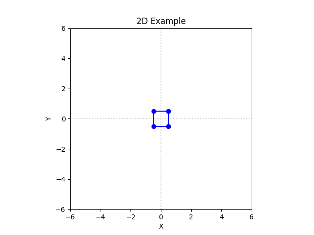
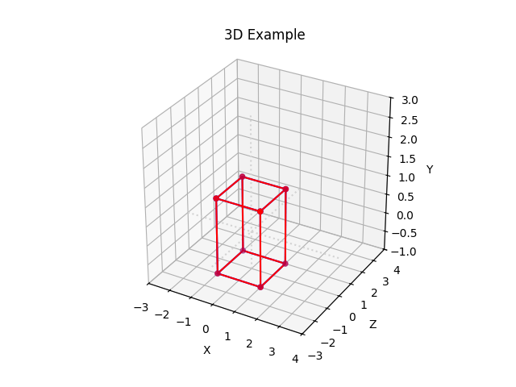
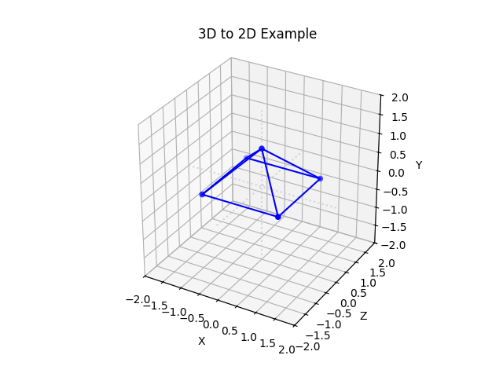

# Transformation Visualizer

Geometric transformations underpin computer graphics—from camera panning in games to rotating 3D models in simulations. This repository turns those mathematical concepts into living animations, so you can see and experiment with each step.

## What’s Inside

This library comprises three core components, each powered by homogeneous transformation matrices:

* **TransformPipeline**: Construct and chain translations, rotations, scalings, projections, or custom matrices for 2D (3×3) or 3D (4×4) point sets.
* **Shape**: Binds a point array and edge list to a `TransformPipeline`, representing an animated object you can visualize.
* **TransformVisualizer**: Takes one or more `Shape` instances and renders their transformations in real time or exports as a GIF.

Under the hood, each transformation is a matrix multiplication—making chaining seamless and mathematically robust. You can step through each transformation and inspect intermediate results.

### 2D Example



A square that travels around the origin and spins 45° about its center at each stop.

```python
import numpy as np
from lib.Shape import Shape
from lib.TransformVisualizer import TransformVisualizer

points2D = np.array([
    [-0.5, 0.5, 0.5, -0.5],
    [-0.5, -0.5, 0.5, 0.5]
])
edges2D = [(0,1), (1,2), (2,3), (3,0)]

square = Shape(points2D, edges2D) \
    .translate(2, 2).rotate(np.pi/4, pivot=(2, 2)) \
    .translate(-4, 0).rotate(np.pi/4, pivot=(-2, 2)) \
    .translate(0, -4).rotate(np.pi/4, pivot=(-2, -2)) \
    .translate(4, 0).rotate(np.pi/4, pivot=(2, -2))

TransformVisualizer(dim=2)  \
    .with_viewport((-6, 6), (-6, 6))  \
    .with_shape(square, 'blue')    \
    .with_title('2D Example')  \
    .show()
```

### 3D Example



A practical demonstration that geometric transformations are not commutative: Two cubes perform the same transformations in opposite orders, leading to distinct final orientations and positions.

```python
import numpy as np
from lib.Shape import Shape
from lib.TransformVisualizer import TransformVisualizer

points3D = np.array([
    [-1, -1, 1, 1, -1, -1, 1, 1],
    [-1, 1, 1, -1, -1, 1, 1, -1],
    [-1, -1, -1, -1, 1, 1, 1, 1]
])
edges3D = [(0,1),(1,2),(2,3),(3,0),(4,5),(5,6),(6,7),(7,4),(0,4),(1,5),(2,6),(3,7)]

cube_a = Shape(points3D, edges3D) \
    .translate(0, 1, 2) \
    .rotate(np.pi/4, axis='x') \
    .scale(1.5, 1.5, 1.5)

cube_b = Shape(points3D, edges3D) \
    .scale(1.5, 1.5, 1.5) \
    .rotate(np.pi/4, axis='x') \
    .translate(0,1,2)

TransformVisualizer(dim=3) \
    .with_viewport((-3, 4),(-3, 4),(-1, 3)) \
    .with_shape(cube_a, 'blue') \
    .with_shape(cube_b, 'red') \
    .with_title('3D Example') \
    .show()
```

### 3D to 2D projection



This example defines a custom pyramid, applies rotations, non-uniform scaling, translation, and then uses a parallel projection to flatten it onto the XY-plane.

```python
import numpy as np
from lib.Shape import Shape
from lib.TransformVisualizer import TransformVisualizer

points3D = np.array([
    [1, -1, -1, 1, 0],
    [0, 0, 0, 0, 1],
    [1, 1, -1, -1, 0]
])
edges3D = [(0,1), (1,2), (2,3), (3,0), (4,0), (4,1), (4,2), (4,3)]

pyramid = Shape(points3D, edges3D) \
    .rotate(np.pi/6, axis='y') \
    .scale(0.8, 2.5, 0.8) \
    .translate(0, -1, 0) \
    .parallel_projection(direction=(0, 0, 1), eliminate='z')

TransformVisualizer(dim=3) \
    .with_viewport((-2, 2),(-2, 2),(-2, 2)) \
    .with_shape(pyramid, 'blue') \
    .with_title('3D to 2D Example') \
    .show()
```
